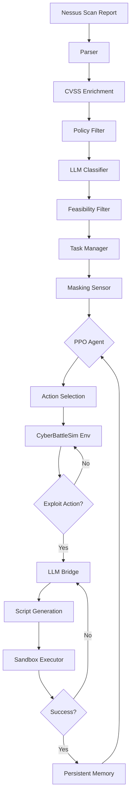

# AUVAP-PPO System Architecture

**Version**: 1.0
**Last Updated**: 2025-11-10
**Status**: Production-Ready

---

## Table of Contents

1. [Overview](#overview)
2. [System Components](#system-components)
3. [Data Flow](#data-flow)
4. [Component Interactions](#component-interactions)
5. [Technology Stack](#technology-stack)
6. [Deployment Architecture](#deployment-architecture)

---

## Overview

AUVAP-PPO is a hybrid AI system combining Large Language Models (LLMs) with Deep Reinforcement Learning (DRL) for automated vulnerability assessment and penetration testing.

### Key Innovations

1. **LLM↔DRL Feedback Loop**: Iterative refinement of exploit scripts through execution feedback
2. **Masking Sensor**: Intelligent action space constraint based on vulnerability context
3. **Persistent Memory**: SQLite-based exploitation history for incremental learning
4. **Terrain Generation**: Synthetic network environments for training and benchmarking
5. **Priority-Based Task Management**: Risk-scored task execution with attempt limits

---

## System Components

### 1. Vulnerability Assessment Pipeline (AUVAP)

```
[Nessus Scan] → [Parser] → [CVSS Enrichment] → [Policy Filter] →
[LLM Classifier] → [Feasibility Filter] → [Task Manager]
```

#### 1.1 Parser (`parser.py`)
- **Purpose**: Normalizes vulnerability findings from scan reports
- **Input**: Nessus XML/CSV reports
- **Output**: Structured VAFinding objects
- **Features**:
  - Content-based format detection
  - Schema validation
  - Deduplication by finding_id (SHA-1 hash)
  - Data quality tracking

#### 1.2 CVSS Enrichment (`cvss_calculator.py`)
- **Purpose**: Computes/validates CVSS scores
- **Integration**: NVD API for CVE lookups
- **Output**: Enriched findings with validated scores

#### 1.3 Policy Engine (`policy_engine.py`, `policy_loader.py`)
- **Purpose**: Applies organizational security policies
- **Configuration**: YAML-based policy rules
- **Operators**: 19 operators (in, eq, contains, regex, range, exists, etc.)
- **Features**: Conflict detection, precedence hierarchy

#### 1.4 LLM Classifier (`classifier_v2.py`)
- **Purpose**: Classifies vulnerabilities for automation feasibility
- **Providers**: OpenAI, Gemini, GitHub Models, Local LLMs
- **Features**:
  - Schema validation and auto-fixing
  - Retry logic with exponential backoff
  - Few-shot learning with prompt truncation
  - Metrics tracking (latency, entropy, FPR)

#### 1.5 Task Manager (`task_manager.py`)
- **Purpose**: Manages exploit task lifecycle
- **Features**:
  - Risk scoring: r(f) = cvss × w_surface × w_auto
  - Priority-based queue management
  - Attempt limit enforcement
  - Task manifest generation

---

### 2. Deep Reinforcement Learning (DRL) System

```
[PPO Agent] ↔ [CyberBattleSim Environment] ↔ [Terrain Generator]
      ↓
[Masking Sensor] → [Action Space Constraints]
      ↓
[Sandbox Executor] → [LLM Bridge] → [Persistent Memory]
```

#### 2.1 PPO Agent (`ppo_agent.py`)
- **Algorithm**: Proximal Policy Optimization
- **Architecture**: Actor-Critic with shared layers
  - **Observation Space**: 128-dimensional vector
  - **Action Space**: 50 discrete actions (exploits + lateral movement)
  - **Hidden Layers**: 256 → 128 neurons (ReLU activation)
  - **Outputs**: Policy logits + Value estimate
- **Training**:
  - GAE (λ=0.95) for advantage estimation
  - Clipped surrogate objective (ε=0.2)
  - Entropy regularization (α=0.01)
  - Gradient clipping (max_norm=0.5)
- **Features**: Action masking, model save/load

#### 2.2 CyberBattleSim Environment (`execution/cyber_env.py`)
- **Purpose**: Realistic penetration testing simulation
- **Implementation**: Gymnasium wrapper for CyberBattleSim
- **State Representation**:
  - Node ownership (one-hot encoding)
  - Network topology (adjacency features)
  - Discovered vulnerabilities and credentials
- **Action Space**:
  - Exploitation actions (0-39): CVE-specific exploits
  - Lateral movement (40-49): Network traversal
- **Reward Shaping**:
  - Discovery: +0.1 (new node/vuln found)
  - Exploitation: +0.5 (successful exploit)
  - Control: +1.0 (node fully compromised)
- **Episode Termination**: Max 200 steps or full network control

#### 2.3 Terrain Generator (`execution/terrain_generator.py`)
- **Purpose**: Generates synthetic networks for training
- **Topologies**: Erdos-Renyi, Barabasi-Albert, Scale-free, Tree
- **Node Attributes**:
  - OS: Linux (50%), Windows (40%), macOS (10%)
  - Roles: Workstation (50%), Server (30%), Router (10%), Firewall (10%)
  - Services: Based on role and OS
  - Vulnerabilities: Configurable density
  - Credentials: Username/password pairs
  - Firewall rules
- **Features**: Deterministic generation (seed-based), attack path validation
- **Terrain ID**: SHA-256 hash for uniqueness

#### 2.4 Masking Sensor (`environment/masking_sensor.py`)
- **Purpose**: Constrains action space based on context
- **Algorithm**: Section I, Contribution #3 from paper
- **Features**:
  - Exposes one prioritized finding at a time
  - Safety constraints (timeout, network isolation, resource limits)
  - Execution logging for deterministic replay
  - Task status tracking

#### 2.5 Sandbox Executor (`execution/sandbox_executor.py`)
- **Purpose**: Safe exploit script execution
- **Implementation**: Docker containerization
- **Resource Limits**:
  - Memory: 512MB (configurable)
  - CPU: 1.0 core (configurable)
  - Timeout: 10s default (configurable)
  - Network: Disabled by default
- **Features**: Container cleanup, fallback local execution

#### 2.6 LLM-DRL Bridge (`execution/llm_drl_bridge.py`)
- **Purpose**: Orchestrates LLM↔DRL feedback loop (Algorithm 6)
- **Flow**:
  1. LLM generates initial exploit script
  2. Sandbox executes script
  3. On failure: Extract error trace
  4. LLM refines script based on feedback
  5. Repeat up to max iterations (default: 3)
  6. Store successful attempts in memory
- **Features**: Multi-provider LLM support, script validation

#### 2.7 Persistent Memory (`execution/persistent_memory.py`)
- **Purpose**: Stores exploitation history for learning
- **Implementation**: SQLite database
- **Schema**: `attempts` table with finding_id, task_id, script_content, execution_result, success, metadata, timestamp
- **Operations**:
  - `store_attempt()`: Save exploitation attempt
  - `get_attempts_by_finding()`: Retrieve attempts for vulnerability
  - `get_similar_attempts()`: Find similar exploits (CVE, service, technique)
  - `get_successful_attempts()`: Filter working exploits
  - `clear_old_attempts()`: Prune by age
- **Features**: Thread-safe, JSON serialization, fast similarity search

---

## Data Flow

### End-to-End Execution Flow



### Training Flow

```
[Terrain Generator] → [CyberBattleSim] → [Episode Loop]
                                               ↓
                      [Trajectory Collection] ← [PPO Agent]
                                               ↓
                      [GAE Computation] → [Policy Update]
                                               ↓
                      [Checkpoint Save] → [Next Episode]
```

---

## Component Interactions

### 1. AUVAP Pipeline Interactions

**Parser ↔ CVSS Enrichment**
- Parser outputs structured findings
- CVSS enrichment validates/computes scores
- Enhanced findings flow to policy filter

**Policy Filter ↔ LLM Classifier**
- Policy filter removes organizational exclusions
- Approved findings sent to LLM for classification
- Classification results guide task prioritization

**Task Manager ↔ Masking Sensor**
- Task manager creates prioritized task queue
- Masking sensor exposes one task at a time to agent
- Completed tasks update in task manager

### 2. DRL System Interactions

**PPO Agent ↔ CyberBattleSim**
- Agent receives observations (128-dim vector)
- Agent selects actions (masked based on state)
- Environment returns (next_state, reward, done)
- Episode trajectories used for policy updates

**Masking Sensor ↔ PPO Agent**
- Sensor provides valid action mask
- Agent respects mask during action selection
- Invalid actions have -inf logits (never selected)

**LLM Bridge ↔ Sandbox Executor**
- Bridge generates exploit scripts via LLM
- Sandbox executes scripts in isolated containers
- Execution results (success/failure/error) returned
- On failure, error trace sent back to LLM

**Sandbox Executor ↔ Persistent Memory**
- Sandbox execution results stored in memory
- Successful exploits retrievable for similar vulnerabilities
- Memory provides context for future LLM generation

---

## Technology Stack

### Core Technologies

| Component | Technology | Version |
|-----------|-----------|---------|
| Language | Python | 3.8+ |
| DRL Framework | PyTorch | 2.0+ |
| RL Environment | Gymnasium | 0.29+ |
| Simulation | CyberBattleSim | Latest |
| LLM Providers | OpenAI, Gemini, Local | Various |
| Containerization | Docker | 20.10+ |
| Database | SQLite | 3.x |
| Graph Library | NetworkX | 3.0+ |
| Testing | pytest | 7.0+ |

### Python Dependencies

```
torch>=2.0.0
gymnasium>=0.29.0
networkx>=3.0
docker>=6.0.0
openai>=1.0.0
google-generativeai>=0.3.0
pyyaml>=6.0
sentence-transformers>=2.2.0 (optional)
psutil>=5.9.0 (for benchmarks)
```

---

## Deployment Architecture

### Containerized Deployment

```
┌─────────────────────────────────────────────────────────┐
│                     Docker Compose                      │
├─────────────────────────────────────────────────────────┤
│                                                         │
│  ┌──────────────────┐  ┌─────────────────────────┐   │
│  │  AUVAP Pipeline  │  │   DRL Training Service  │   │
│  │                  │  │                         │   │
│  │  • Parser        │  │  • PPO Agent            │   │
│  │  • Classifier    │  │  • CyberBattleSim       │   │
│  │  • Policy Engine │  │  • Terrain Generator    │   │
│  │  • Task Manager  │  │  • Training Loop        │   │
│  └──────────────────┘  └─────────────────────────┘   │
│           │                       │                    │
│           └───────────┬───────────┘                    │
│                       ↓                                │
│  ┌─────────────────────────────────────────────────┐  │
│  │            Shared Services                       │  │
│  │  • Sandbox Executor (Docker-in-Docker)          │  │
│  │  • Persistent Memory (SQLite)                   │  │
│  │  • LLM Bridge (Multi-provider)                  │  │
│  └─────────────────────────────────────────────────┘  │
│                                                         │
└─────────────────────────────────────────────────────────┘
```

### Production Deployment Considerations

1. **Scalability**
   - Horizontal scaling for classification (multiple LLM workers)
   - Distributed RL training (Ray/RLlib integration)
   - Database replication for memory system

2. **Security**
   - Network isolation for sandbox containers
   - Secrets management (Vault, AWS Secrets Manager)
   - Input sanitization for exploit scripts
   - Rate limiting for LLM API calls

3. **Monitoring**
   - Prometheus metrics export
   - Grafana dashboards (training progress, exploitation success rate)
   - Structured JSON logging
   - Alerting on failures

4. **High Availability**
   - Multiple LLM provider fallbacks
   - Task queue persistence (Redis)
   - Checkpoint-based training resumption
   - Database backups

---

## Performance Characteristics

### Throughput Metrics

| Component | Throughput | Notes |
|-----------|-----------|-------|
| Parser | 1000+ findings/s | XML/CSV parsing |
| Policy Filter | 5000+ findings/s | Rule evaluation |
| Risk Scoring | 80,000+ scores/s | Mathematical computation |
| PPO Forward Pass | ~330 samples/s | Batch size 32, CPU |
| Action Selection | ~1000 actions/s | Single observation |
| Training Iteration | ~125 iter/min | Episode length 200 |
| Sandbox Execution | ~10 tasks/min | Depends on script complexity |

### Resource Requirements

**Minimum**:
- CPU: 4 cores
- RAM: 8GB
- GPU: Optional (speeds up PPO training 3-5x)
- Disk: 10GB (database, checkpoints, logs)

**Recommended**:
- CPU: 8+ cores
- RAM: 16GB
- GPU: NVIDIA GPU with 4GB+ VRAM
- Disk: 50GB SSD

---

## Extension Points

### 1. Custom Environments
Implement Gymnasium interface:
```python
class CustomPentestEnv(gym.Env):
    def reset(self): ...
    def step(self, action): ...
    def render(self): ...
```

### 2. Custom Reward Functions
Override in CyberBattleEnv:
```python
def _compute_reward(self, state, action, next_state):
    # Custom reward logic
    return reward
```

### 3. Custom Policy Operators
Add to `policy_loader.py`:
```python
elif operator == 'custom_op':
    return lambda f: custom_logic(f)
```

### 4. Custom LLM Providers
Add to `classifier_v2.py`:
```python
elif provider == "custom":
    return _classify_with_custom(finding, ...)
```

---

## Appendix: Algorithms

### Algorithm 5: Terrain Generation
```
Input: TerrainParams (nodes, topology, densities)
Output: NetworkX graph G, terrain_id

1. Generate base topology (Erdos-Renyi/BA/SF/Tree)
2. Ensure weak connectivity
3. For each node:
   a. Sample OS from distribution
   b. Sample role from distribution
   c. Generate services based on (role, OS)
   d. Generate vulnerabilities (density)
   e. Generate credentials (density)
   f. Apply firewall rules (probability)
4. Validate attack paths exist
5. Calculate terrain_id = SHA256(G)
6. Return (G, terrain_id)
```

### Algorithm 6: LLM↔DRL Bridge
```
Input: Finding f, Task t, max_iterations K
Output: (success, result, script)

1. iteration ← 0
2. While iteration < K:
   a. Generate script S via LLM(f, t, previous_errors)
   b. result ← SandboxExecutor.execute(S)
   c. If result.success:
      - PersistentMemory.store(f, t, S, result, success=True)
      - Return (True, result, S)
   d. Else:
      - Extract error trace from result
      - previous_errors.append(error_trace)
      - iteration ← iteration + 1
3. Return (False, result, None)
```

---

**Document Version**: 1.0
**Maintained By**: AUVAP-PPO Development Team
**License**: See project LICENSE file
